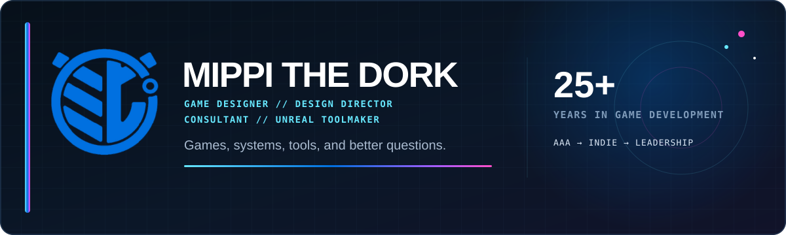
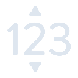

  

  
  
  

  
  
  
  

  
  
  
  

## Hey, I'm Mippi

I've spent **25+ years in game development** working across AAA, indie, live service, technical design, creative direction, game direction, studio leadership, consulting, and Unreal Engine development.

My center of gravity is **Game Design**. I care about finding the fun, identifying the problem that actually matters, communicating clearly enough for a team to build the right thing, and removing friction when the tools get in the way.

A lot of the code here starts with one question:

> **Why am I fighting the editor to do this?**

When the answer is "I probably shouldn't be," I tend to build something.

### A few things I care about

- **Player experience first.** Systems only matter if they create something meaningful on the other side of the screen.
- **Solve the actual problem.** A smaller correct solution beats a larger clever one.
- **Clarity is part of design.** That applies to players, teams, tools, documentation, and communication.
- **Tools should disappear into the workflow.** The best editor utility feels like it should have always been there.
- **Share the useful stuff.** If I solve a problem other developers probably have, I would rather put it in their hands.

<a href="https://mippi-the-dork.github.io/"><b>Explore the interactive portfolio →</b></a>

## Games, Design & Development

| Project / Work | What it is |
| :-- | :-- |
| **Project Heavy Water** | An original second-person perspective horror project exploring camera ownership, navigation, vulnerability, and perspective as gameplay. |
| **Design Consulting** | Design diagnosis, combat, progression, systems, UX, preproduction, and creative direction across a growing list of indie projects. |
| **Azure Altar** | A long-running Unreal Engine testbed, updated across engine versions to learn, validate, and demonstrate modern workflows in a practical environment. |
| **Unannounced Project** | My first Game Director role. Still under NDA, still unannounced, and a major learning experience I am excited to talk about when I finally can. |

### Selected career trail

`Mob Entertainment` · `Oberha5li` · `Seven20 / deadmau5` · `Square Enix` · `Gamigo` · `Aeria Games` · `NCSoft` · `ChangYou` · `Electronic Arts` · `Insomniac Games` · `Naughty Dog` · `Rockstar Games` · `Sony Computer Entertainment America`

Selected recognizable work includes **Poppy Playtime, Tomb Raider, Dragon Quest, Ratchet & Clank, Jak and Daxter, Grand Theft Auto**, plus a lot of work that is less recognizable from a logo but just as responsible for the scars.

## Unreal Engine Tools

I build focused editor utilities to make game development **faster, easier, clearer, and less annoying**.

Released tools are always available **free on GitHub**. Where a FAB version exists, it is **$0.99** for people who want the convenience or insist on contributing something back.

### Released

|  | Tool | What it fixes | Access |
| :-: | :-- | :-- | :-- |
|  | **[Hue](https://github.com/mippi-the-dork/Hue)** | Blueprint node styling | **GitHub Free** · FAB coming soon |
|  | **[Prune](https://github.com/mippi-the-dork/Prune)** | Details panel presets and organization | **GitHub Free** · FAB coming soon |
|  | **[Latch](https://github.com/mippi-the-dork/Latch)** | Outliner hierarchy locking | [GitHub Free](https://github.com/mippi-the-dork/Latch) · [FAB $0.99](https://www.fab.com/listings/280bc637-782a-45a3-a949-9423e745bf34) |
|  | **[Digit](https://github.com/mippi-the-dork/Digit)** | Digit-aware numeric scrubbing | **GitHub Free** · FAB coming soon |
|  | **[Lux](https://github.com/mippi-the-dork/Lux)** | Viewport headlamp | [GitHub Free](https://github.com/mippi-the-dork/Lux) · [FAB $0.99](https://www.fab.com/listings/1e650e52-7265-44db-a8a5-65b8343df176) |
|  | **[Focus](https://github.com/mippi-the-dork/Focus)** | Outliner visibility, solo, and lock | [GitHub Free](https://github.com/mippi-the-dork/Focus) · [FAB $0.99](https://www.fab.com/listings/d60d5b75-0adc-41fb-b177-dc90dcd5948d) |
|  | **[Surface](https://github.com/mippi-the-dork/Surface)** | Details panel workflow | [GitHub Free](https://github.com/mippi-the-dork/Surface) · [FAB $0.99](https://www.fab.com/listings/227598e2-fe87-460a-a572-3791ce9bfb08) |
|  | **[Origin](https://github.com/mippi-the-dork/Origin)** | Parenting and anchor utilities | [GitHub Free](https://github.com/mippi-the-dork/Origin) · [FAB $0.99](https://www.fab.com/listings/d3d0fb3a-bbe1-493e-840a-a533a6f16466) |
|  | **[Stem](https://github.com/mippi-the-dork/Stem)** | Outliner row height | [GitHub Free](https://github.com/mippi-the-dork/Stem) · [FAB $0.99](https://www.fab.com/listings/ed18af37-20f9-4523-94d5-d795091c1185) |
|  | **[Chroma](https://github.com/mippi-the-dork/Chroma)** | Outliner color | [GitHub Free](https://github.com/mippi-the-dork/Chroma) · [FAB $0.99](https://www.fab.com/listings/37e1c2d1-f16e-4e44-befb-55e0451f412f) |
|  | **[Link](https://github.com/mippi-the-dork/Link)** | Viewport synchronization | [GitHub Free](https://github.com/mippi-the-dork/Link) · [FAB $0.99](https://www.fab.com/listings/ca9e33a3-4d43-4f6d-8deb-ef113e629cb1) |
|  | **[Index](https://github.com/mippi-the-dork/Index)** | Custom Outliner ordering | [GitHub Free](https://github.com/mippi-the-dork/Index) · [FAB $0.99](https://www.fab.com/listings/9d36184a-d4dc-4049-850f-8ce28b74a560) |
|  | **[Sweep](https://github.com/mippi-the-dork/Sweep)** | Blueprint Variable Get cleanup | [GitHub Free](https://github.com/mippi-the-dork/Sweep) · [FAB $0.99](https://www.fab.com/listings/49c1d420-458d-4e4f-8ede-b994f561e459) |

### In Development

| Tool | What it is exploring | Access |
| :-- | :-- | :-- |
| **[Unmark](https://github.com/mippi-the-dork/Unmark)** | Markdown-native Unreal documentation | Private · WIP |
| **[Omni](https://github.com/mippi-the-dork/Omni)** | Area-based navigation link authoring | Public · WIP |
| **[Portal](https://github.com/mippi-the-dork/Portal)** | Named Reroute Nodes for Blueprints | Public · WIP |
| **Metric** | Quick-access level design metrics | Private · WIP |
| **Sniff** | PCG wire data inspection | Private · WIP |
| **Static** | Granular Actor Instance Parameter locking | Private · WIP |
| **Rescue** | Fuzzy and semantic Blueprint node search | Private · WIP |
| **Axis** | Expanded editor transform tools | Private · WIP |
| **Aid** | Actor relationship visualization | Private · WIP |
| **Confine** | Unused asset quarantine | Private · WIP |
| **Graze** | Actor Palette workflow tools | Private · WIP |
| **Badge** | Content Browser production badges | Private · WIP |
| **Flow** | A* traversal-cost visualization | Private · WIP |
| **Husk** | Automatic collision volume generation | Private · WIP |

> **Private repository note:** private project names and descriptions are intentionally public. Repository links only resolve for people who already have access.

  
  

## Crafting Play

**[Crafting Play](https://crafting-play.vercel.app/)** is my living game design knowledge base, built around turning experience, intuition, theory, and production reality into **usable ways to think**.

It includes design frameworks, genre and player-fantasy analysis, case studies, workbooks, problem-diagnosis tools, and lessons accumulated from actually making games.

> I am less interested in telling designers what to think than giving them better tools for **how to think through the problem**.

## Unreal Community & Learning

### Unreal Source

Whether you're brand new to Unreal or have shipped with it for years, **[Unreal Source](https://unrealsource.com/)** is home to more than 130,000 developers sharing answers, workflows, discoveries, and hard-earned lessons.

[Visit Unreal Source](https://unrealsource.com/) · [Join the Discord](https://discord.gg/unrealsource)

### Epic Learning Center

Epic provides a huge amount of official free learning material, including courses, tutorials, talks, demos, livestreams, learning paths, knowledge-base articles, and example projects.

[Browse curated Unreal learning](https://dev.epicgames.com/community/unreal-engine/learning?source=epic_games&types=tutorial,course,talks_and_demos,livestream,learning_path,knowledge_base,knowledge_base,recommended_community_tutorial)

## Find Me Around the Internet

| Place | Why you might care |
| :-- | :-- |
| **[Portfolio](https://mippi-the-dork.github.io/)** | Games, career, consulting, tools, experiments, Doug, and several things you probably were not supposed to click |
| **[LinkedIn](https://www.linkedin.com/in/mippithedork/)** | Career history and professional contact |
| **[Crafting Play](https://crafting-play.vercel.app/)** | Game design frameworks, models, workbooks, and practical craft |
| **[FAB](https://www.fab.com/sellers/Mippithedork)** | Unreal Engine tools for people who insist on giving me 99 cents |
| **[Unreal Source](https://unrealsource.com/)** | Unreal community, discussion, help, and shared knowledge |
| **[Steam](https://steamcommunity.com/id/mippithedork/)** | Add me if you want to know what I am actually playing |

   
  <b>Make the game better. Make the workflow better. Share what you learn.</b> 
  © 2026 Mippi the Dork

