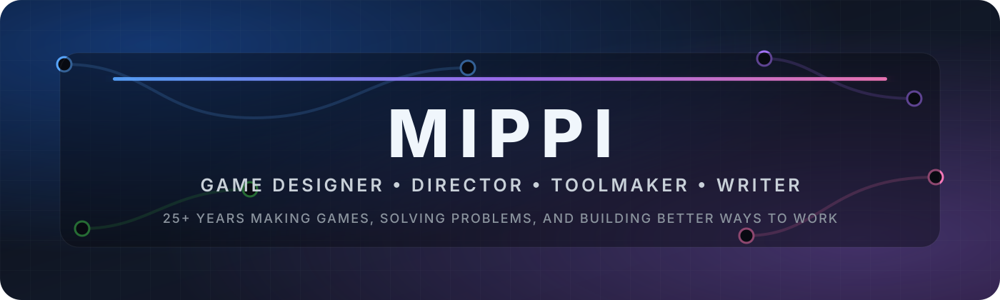

<p align="center">
  
</p>

<p align="center">
  <a href="https://www.linkedin.com/in/mippithedork/"></a>
  <a href="https://crafting-play.vercel.app/"></a>
  <a href="https://www.fab.com/sellers/Mippithedork"></a>
  <a href="https://discord.gg/unrealsource"></a>
</p>

<p align="center">
  
  
  
  
</p>

## Hey, I'm Mippi

I've spent **25+ years in the game industry** designing games, levels, systems, stories, tools, workflows, and occasionally the thing that makes the other thing less annoying to use.

My center of gravity is **Game Design**, but a long career in development has a way of turning you into a multidisciplinary problem solver. I care about finding the fun, communicating the design clearly, reducing friction for the team, and building tools when the existing workflow gets in the way.

A lot of the code here comes from the same question:

> **Why am I fighting the editor to do this?**

When the answer is "I probably shouldn't be," I tend to build something.

### What I care about

- **Player experience first.** Systems only matter if they create something meaningful on the other side of the screen.
- **Clarity is part of the design.** For players, developers, tools, documentation, and communication.
- **Solve the actual problem.** A smaller correct solution beats a larger clever one.
- **Tools should disappear into the workflow.** The best editor utility feels like it should have always been there.
- **Share the useful stuff.** If I solve a problem that other developers probably have, I would rather put it in their hands.

---

## Unreal Engine Tools

I build focused Unreal Engine tools that remove small, persistent points of friction from everyday development.

Most are intentionally narrow. They are not trying to become another giant framework. They solve one workflow problem, integrate with Unreal's existing editor behavior, and stay out of the way when you do not need them.

### Released

| Project | What it does | Release State | Visibility |
| :-- | :-- | :--: | :--: |
| **[Chroma](https://github.com/mippi-the-dork/Chroma)** | Color organization for Actors and Folders, including Outliner tinting, matching selection, colored outlines, and viewport visualization. |  |  |
| **[Digit](https://github.com/mippi-the-dork/Digit)** | Houdini-style, digit-aware numeric scrubbing for Unreal Editor number fields. |  |  |
| **[Focus](https://github.com/mippi-the-dork/Focus)** | Visibility, Solo, selection locking, and edit protection directly in the World Outliner. |  |  |
| **[Hue](https://github.com/mippi-the-dork/Hue)** | Persistent Blueprint node styling with Instance, Category, Global, inheritance, and multi-select workflows. |  |  |
| **[Index](https://github.com/mippi-the-dork/Index)** | Persistent manual hierarchy ordering inside Unreal's standard World Outliner. |  |  |
| **[Latch](https://github.com/mippi-the-dork/Latch)** | Persistent expansion latches, Mixed View, and Keep Visible hierarchy controls for the World Outliner. |  |  |
| **[Link](https://github.com/mippi-the-dork/Link)** | Links multiple Level Editor viewport camera transforms while preserving useful relative relationships. |  |  |
| **[Lux](https://github.com/mippi-the-dork/Lux)** | A toggleable viewport headlamp for inspecting dark environments without changing the level's actual lighting. |  |  |
| **[Origin](https://github.com/mippi-the-dork/Origin)** | Adjustable assembly pivots and hierarchy controls that let you reposition a parent pivot without moving its children. |  |  |
| **[Stem](https://github.com/mippi-the-dork/Stem)** | World Outliner hierarchy guides with selected and hovered path highlighting plus adjustable line styling. |  |  |
| **[Surface](https://github.com/mippi-the-dork/Surface)** | Brings Component properties into an Actor's Details panel with filters, grouped favorites, and fast selection tools. |  |  |
| **[Sweep](https://github.com/mippi-the-dork/Sweep)** | Cleans up Blueprint graphs by distributing shared Variable Get nodes beside consumers or consolidating equivalent Gets. |  |  |

### In Development

| Project | What it is exploring | Release State | Visibility |
| :-- | :-- | :--: | :--: |
| **[Prune](https://github.com/mippi-the-dork/Prune)** | Hide, show, filter, and reorder Details panel sections so the panel reflects the way you actually work. |  |  |
| **[Unmark](https://github.com/mippi-the-dork/Unmark)** | Editor-native linking and navigation tools with link types, thumbnails, editing, and a dedicated Links workflow. |  |  |
| **[Omni](https://github.com/mippi-the-dork/Omni)** | Higher-level navigation authoring that turns designer intent into standard Unreal navigation links. |  |  |
| **[Portal](https://github.com/mippi-the-dork/Portal)** | Named Reroute Nodes for Blueprints, bringing Material Graph and PCG Graph style named routing to Blueprint graphs. |  |  |

> **Private repository note:** private project names and descriptions listed here are intentionally public. The links only resolve for GitHub users who already have access to those repositories.

<!--
PRIVATE PROJECT TEMPLATE

| **[Project Name](https://github.com/mippi-the-dork/ProjectName)** | Short description. |  |  |

Change WIP to RELEASED and use color 2ea44f when the project ships.
-->

<p align="center">
  <a href="https://github.com/mippi-the-dork?tab=repositories">
    
  </a>
</p>

---

## Crafting Play

**[Crafting Play](https://crafting-play.vercel.app/)** is my living game design knowledge base.

It is built around the part of game design I care about most: turning experience, intuition, theory, and messy production reality into **usable ways to think**.

It includes:

- Game design frameworks and models
- Genre dissection and player fantasy analysis
- Design theory and case studies
- Ideation, pre-production, production, and post-mortem workbooks
- Practical tools for diagnosing design problems
- Notes collected from decades of actually making games

I am less interested in telling designers what to think than giving them better tools for **how to think through the problem**.

<p align="center">
  <a href="https://crafting-play.vercel.app/">
    
  </a>
</p>

---

## Game Design

My background crosses a lot of disciplines, but the through-line is always design.

```text
GAME DESIGN
├── Systems & Mechanics
├── Level Design
├── Narrative Design
├── Player Psychology
├── Progression & Balance
├── Prototyping & Discovery
├── Design Leadership
├── Documentation & Communication
└── Tools that help teams do all of the above
```

The job is not to have the most ideas.

The job is to understand **which problem matters**, find the version that creates the strongest player experience, communicate it clearly enough that a team can build it, and keep testing whether the thing is actually fun.

---

## Find Me Around the Internet

| Place | Link | Why you might care |
| :-- | :-- | :-- |
| **LinkedIn** | [linkedin.com/in/mippithedork](https://www.linkedin.com/in/mippithedork/) | Career, industry work, and professional contact |
| **Crafting Play** | [crafting-play.vercel.app](https://crafting-play.vercel.app/) | Game design frameworks, models, workbooks, theory, and practical craft |
| **Fab** | [Mippithedork on Fab](https://www.fab.com/sellers/Mippithedork) | Unreal Engine tools and plugins |
| **Unreal Source** | [discord.gg/unrealsource](https://discord.gg/unrealsource) | Unreal Engine community, discussion, help, and shared knowledge |
| **GitHub** | [github.com/mippi-the-dork](https://github.com/mippi-the-dork) | Source, releases, experiments, and whatever problem annoyed me enough to become a plugin |

---

<p align="center">
  <b>Make the game better. Make the workflow better. Share what you learn.</b>
</p>
